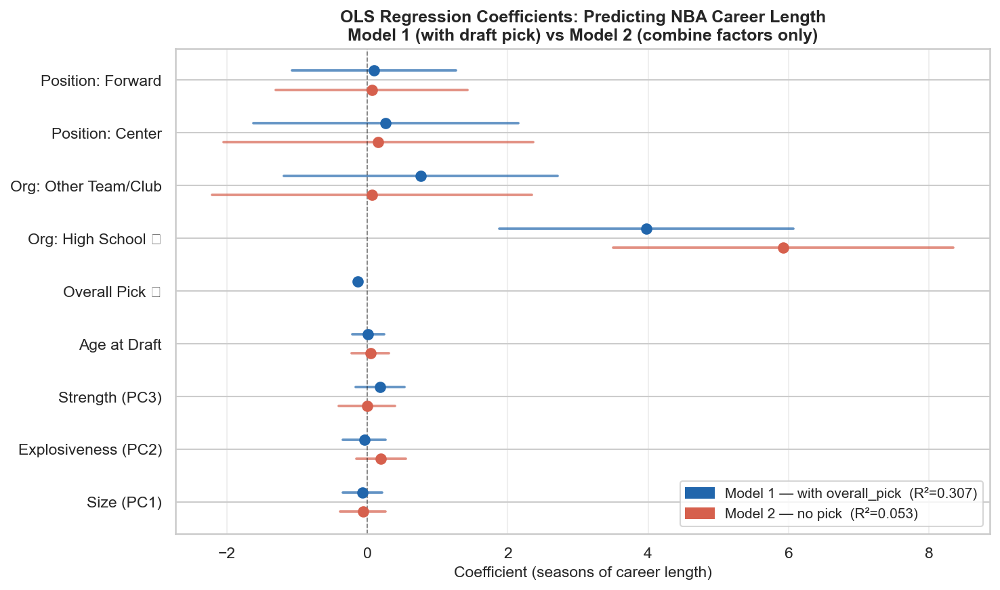
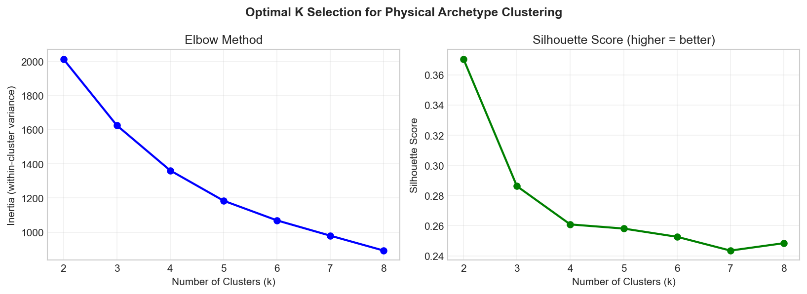
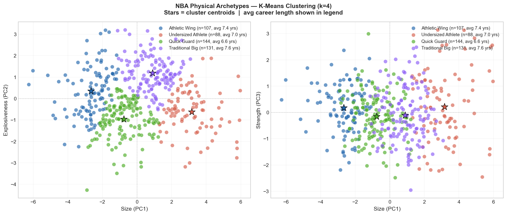
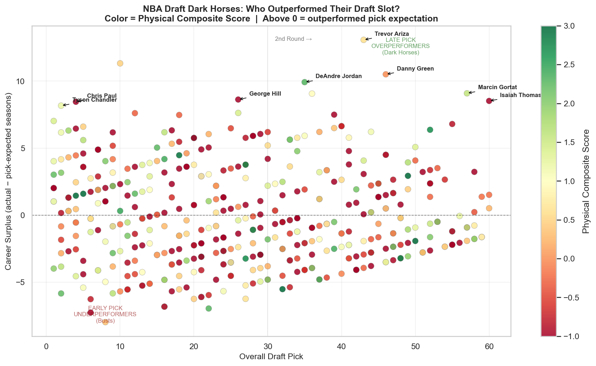
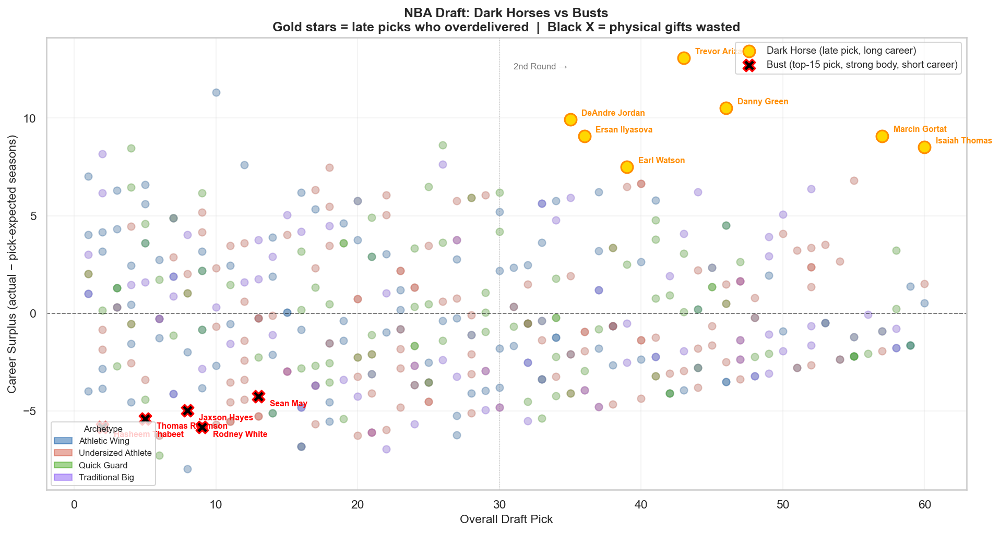
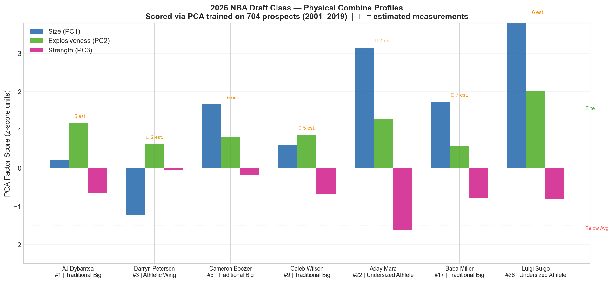

# NBA Draft Intelligence: From Combine Measurements to Career Predictions

**Authors:** Luc-Alexandre Grenier 
  
**Dataset:** [wyattowalsh/basketball](https://www.kaggle.com/datasets/wyattowalsh/basketball) (Kaggle) — 65,000+ games, 4,000+ players, 2001–2019

---

## Project Overview

Can NBA combine measurements predict which players will have long, successful careers? This project applies unsupervised and supervised machine learning to NBA draft combine data to answer three questions:

1. What latent physical dimensions do combine measurements capture?
2. Do those dimensions predict career length — and how much does draft position matter?
3. Can we use this framework to spot undervalued prospects and flag potential busts?

---

## Key Findings

### 1. Three Physical Archetypes Explain 75.6% of Combine Variance (PCA)

Principal Component Analysis on 10 combine measurements (704 players, 2001–2019) extracted three interpretable factors:

| Component | Label | Key Measurements | Variance Explained |
|---|---|---|---|
| PC1 | **Size** | Height, wingspan, standing reach, weight | 48.5% |
| PC2 | **Explosiveness** | Vertical leap, sprint speed | 16.5% |
| PC3 | **Strength** | Bench press, body fat % | 10.6% |

### 2. Draft Position — Not Physical Tools — Predicts Career Length (OLS Regression)

Two competing models reveal a striking result:

| | Model 1 (with draft pick) | Model 2 (combine only) |
|---|---|---|
| R² | **0.307** | **0.053** |
| Adj. R² | 0.293 | 0.036 |

**82.7% of Model 1's explanatory power** comes from `overall_pick` alone (β = −0.140, p < .001). Each pick later in the draft predicts 0.14 fewer seasons. Combine factors (Size, Explosiveness, Strength) are statistically insignificant in both models.

**Interpretation:** Teams use physical measurements to set draft position, but once that investment decision is made, raw athleticism scores add no further predictive value. Organizational commitment — proxied by pick number — is what predicts longevity.

### 3. Four Physical Archetypes via K-Means Clustering (k=4)

| Archetype | n | Avg Career | Elite Rate |
|---|---|---|---|
| Athletic Wing | 122 | 6.69 yrs | 1.64% |
| Quick Guard | 108 | 6.44 yrs | **2.78%** |
| Traditional Big | 87 | 6.09 yrs | 1.15% |
| Undersized Athlete | 141 | 5.72 yrs | 0.71% |

**Quick Guards have the highest elite rate despite being drafted latest on average (pick 28).** Chris Paul, Stephen Curry, and Damian Lillard all live in this cluster — physically underwhelming at the combine, historically transcendent in the league.

### 4. Dark Horses & Busts

**Dark horses** (late picks who outperformed career expectations):
- Trevor Ariza (pick 43, 17 seasons), Marcin Gortat (pick 57, 11 seasons), Isaiah Thomas (pick 60, 10 seasons)

**Busts** (top-15 picks with elite physical scores, careers < 5 seasons):
- Hasheem Thabeet (pick 2, 4 seasons), Thomas Robinson (pick 5, 4 seasons), Jaxson Hayes (pick 8, 4 seasons)

The combine flagged Kevin Durant's biggest weaknesses (0 bench press reps, below-average explosiveness) and missed his greatness entirely.

---

## Visualizations

| Figure | Description |
|---|---|
|  | OLS coefficients: Model 1 vs Model 2 |
|  | Elbow & silhouette scores for k selection |
|  | K-means physical archetypes (k=4) |
|  | Career surplus vs draft pick — dark horses & busts |
|  | Physical profiles of over/underperformers |
|  | 2026 draft class scored through PCA framework |

---

## 2026 Draft Class Preview

Using the PCA framework trained on historical data, we scored the 2026 draft combine class:

| Prospect | Proj. Pick | Archetype | Size | Explosiveness | Strength |
|---|---|---|---|---|---|
| AJ Dybantsa | #1 | Athletic Wing | Average | Above Avg | Below Avg |
| Darryn Peterson | #3 | **Quick Guard** | Below Avg | Above Avg | Average |
| Cameron Boozer | #5 | Athletic Wing | Above Avg | Above Avg | Average |
| Caleb Wilson | #9 | Athletic Wing | Average | Above Avg | Below Avg |
| Baba Miller | #17 | Athletic Wing | Above Avg | Above Avg | Below Avg |
| Aday Mara | #22 | Athletic Wing | **Elite** | Elite* | Low |
| Luigi Suigo | #28 | Athletic Wing | **Elite** | Elite* | Below Avg |

*\* Estimated — athletic testing not yet completed at time of analysis*

**Watch Darryn Peterson** — his Quick Guard profile (the archetype with the highest historical elite rate) mirrors Curry, Paul, and Lillard. The combine tends to undersell this archetype.

---

## How to Run

### 1. Install dependencies
```bash
pip install -r requirements.txt
```

### 2. Download the dataset
```python
import kagglehub
path = kagglehub.dataset_download("wyattowalsh/basketball")
```

### 3. Run the analysis
```bash
python nba_pca_analysis.py
```

Or open the Jupyter notebook: `NBA.PCA.5.23.26.ipynb`

---

## Project Structure

```
NBA-Draft-Analysis/
├── nba_pca_analysis.py        # Full analysis pipeline
├── NBA.PCA.5.23.26.ipynb      # Jupyter notebook version
├── requirements.txt
├── data/
│   ├── pca_factor_scores.csv  # PCA output: 458 players × 10 columns
│   └── prospects_2026_scores.csv  # 2026 draft class scores
└── outputs/
    ├── regression_coef_plot.png
    ├── cluster_selection.png
    ├── archetype_clusters.png
    ├── dark_horse_scatter.png
    ├── bust_vs_darkhorse.png
    └── prospects_2026.png
```

---

## Methods Summary

| Step | Method | Library |
|---|---|---|
| Dimensionality reduction | PCA (Kaiser criterion, varimax interpretation) | scikit-learn |
| Career prediction | OLS Linear Regression (two-model comparison) | statsmodels |
| Physical archetypes | K-Means Clustering (k=4, silhouette validated) | scikit-learn |
| Prospect scoring | PCA projection on new combine data | scikit-learn |

---

## Limitations

- Combine attendance is self-selected — top projected picks often skip testing, introducing selection bias
- Career length is a noisy success proxy; it captures longevity but not impact or efficiency
- The high school organization effect is an era artifact (pre-2005 age rule)
- OLS residuals show mild non-normality (Omnibus test significant) — a survival model may be more appropriate
- 2026 prospect scores use partial measurements; several athletic testing variables were imputed at the historical mean
